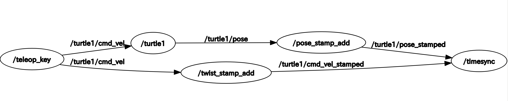

# message_filters_test
Scripts for learning message_filters

## how to run
### prerequisites
* ROS1 (tested with kinetic)
* turtlesim

### download and run

```
cd ~/catkin_ws/src
git clone git@github.com:SatokiOgiso/message_filter_test.git
roslaunch message_filters_test turtlesim_sync.launch 
```

### What you may get

Once you launch, the famous turtlesim with keyboard_telep will be opened.
If you hit any of the arrow key, the cmd_vel and the corresponding pose chosen by the message_filters will be shown in the terminal.

### The connections


